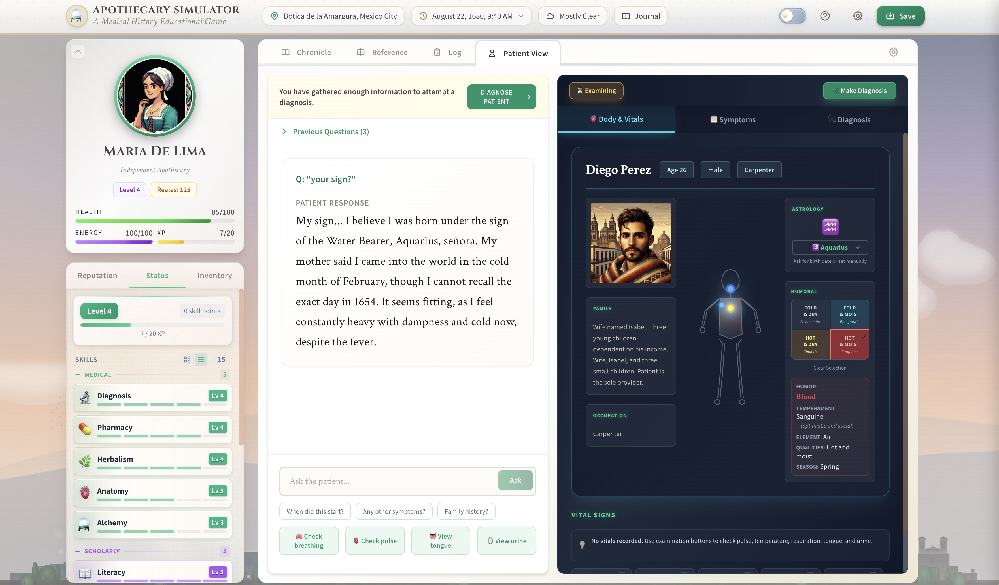

# Apothecary Simulator

**A Medical History Educational Game**

Step into the shoes of Maria de Lima, a converso apothecary in 1680 Mexico City. Diagnose patients using humoral medicine, craft remedies from historical materia medica, navigate the dangers of the Inquisition, and build your reputation in a richly detailed colonial world.


*Examining a patient: Ask questions, check vital signs, and make a diagnosis based on early modern medical theory*

---

## Overview

Apothecary Simulator is a single-player narrative RPG that uses AI agents (GPT-4o/Gemini) to generate dynamic stories, patient encounters, and medical challenges. The game is built on historically-researched content including:

- **100+ authentic materia medica** from 17th-century pharmacopeias
- **Humoral medicine system** with the four humors (blood, phlegm, yellow bile, black bile)
- **Period-accurate social dynamics** including casta hierarchies, religious tensions, and guild politics
- **Procedurally-generated NPCs** with unique appearances, personalities, and medical conditions


*Your shop, the Botica de la Amargura, in colonial Mexico City*

---

## Features

### Medical System
- **Patient Examination**: Ask questions, check pulse, examine tongue, view urine
- **Humoral Diagnosis**: Determine imbalances based on symptoms and patient constitution
- **Body Map**: Visual symptom tracker for locating ailments
- **Treatment Outcomes**: Your prescriptions have consequences - cure, harm, or kill your patients

### Crafting & Alchemy
- **Compound Creation**: Combine ingredients using historical methods
- **Preparation Methods**: Distill, decoct, calcinate, and create confections
- **Emergent Recipes**: The AI validates your combinations based on historical plausibility


*The workshop where you prepare medicines*

### Progression
- **Skill System**: Level up Diagnosis, Pharmacy, Herbalism, Anatomy, Alchemy, and more
- **Profession Paths**: Specialize as an Alchemist, Herbalist, Surgeon, Poisoner, Scholar, or Court Physician
- **Reputation Factions**: Build standing with the Church, Elite, Merchants, Common Folk, Indigenous communities, and the Guild

### Dynamic World
- **30+ Random Events**: Street encounters, religious processions, market opportunities, dangers
- **NPC Relationships**: Characters remember your interactions and form opinions
- **Time & Weather**: Day/night cycle with dynamic weather affecting gameplay
- **Scripted Quests**: Story-driven encounters with recurring characters


*View from inside the botica looking out to the street*

---

## Getting Started

### Prerequisites
- Node.js 18+
- An OpenAI API key (GPT-4o) and/or Google AI API key (Gemini)

### Installation

```bash
# Clone the repository
git clone https://github.com/yourusername/apothecary-simulator.git
cd apothecary-simulator

# Install dependencies
npm install

# Create environment file
cp .env.example .env
# Edit .env and add your API keys:
# VITE_OPENAI_API_KEY=your_openai_key
# VITE_GOOGLE_API_KEY=your_google_key

# Start development server
npm start
```

The game will open at `http://localhost:5173`

### Build for Production

```bash
npm run build
```

Output is in the `dist/` folder, ready for static hosting.

---

## How to Play

### Basic Commands
Type natural language commands to interact with the world:
- `"Open the shop for the day"` - Begin seeing patients
- `"Examine the patient's tongue"` - Gather diagnostic information
- `"Mix chamomile and honey into a decoction"` - Create medicines
- `"Travel to the market"` - Move to different locations

### Special Commands
- `#prescribe` - Open the prescription interface
- `#buy` - Open the market to purchase ingredients
- `#mix` - Open the crafting workshop
- `#sleep` - Rest to restore energy and advance time

### Tips for Success
1. **Ask patients about their symptoms** before diagnosing
2. **Check the humoral balance** - treatments should oppose the imbalance
3. **Manage your energy** - complex tasks drain stamina
4. **Build relationships** - reputation affects who seeks your help
5. **Be careful with the Inquisition** - your converso identity is a secret

---

## Architecture

```
src/
├── core/
│   ├── agents/          # LLM agent coordination (Narrative, State, Entity)
│   ├── entities/        # NPC/Patient/Item data models
│   ├── services/        # LLM integration, save system
│   └── systems/         # Leveling, reputation, resources
├── features/
│   ├── medical/         # Diagnosis, prescriptions, symptoms
│   ├── crafting/        # Mixing workshop
│   ├── commerce/        # Buy/sell mechanics
│   └── character/       # Player stats, portraits
├── scenarios/
│   └── 1680-mexico-city/  # Scenario configuration
└── pages/
    └── GamePage.jsx     # Main game loop
```

### Agent System
The game uses three specialized AI agents:
1. **NarrativeAgent**: Generates story text, dialogue, and scene descriptions
2. **StateAgent**: Extracts structured game state changes from narratives
3. **EntityAgent**: Selects contextually appropriate NPCs and patients

---

## Tech Stack

- **Frontend**: React 18, Tailwind CSS, Framer Motion
- **AI**: OpenAI GPT-4o, Google Gemini 2.0 Flash
- **Build**: Vite
- **State**: React Context + localStorage saves

---

## Contributing

Contributions are welcome! Areas where help is needed:

- **New scenarios**: 1940s New York, 1880s London, or your own historical setting
- **Medical content**: Additional materia medica, diseases, treatments
- **UI/UX**: Accessibility improvements, mobile optimization
- **Testing**: Automated test coverage

See [CLAUDE.md](CLAUDE.md) for detailed technical documentation.

---

## Roadmap

- [ ] LLM response streaming for better UX
- [ ] Multiple save slots
- [ ] Additional historical scenarios
- [ ] Procedural quest generation
- [ ] NPC daily schedules
- [ ] Multiplayer/social features

---

## Credits

**Lead Developer**: Benjamin Breen

**Historical Research**: Based on primary sources from 17th-century medical texts, Inquisition records, and colonial Mexican archives.

**AI Models**: OpenAI GPT-4o, Google Gemini

---

## License

TBD

---

## Key Code Architecture

This section provides excerpts from the most important code files to illustrate how the game's AI-driven narrative system works.

### 1. System Prompts (promptModules.js)

The game's prompts define the AI's behavior, historical constraints, and response format:

```javascript
// Core identity and character
export const universalPromptModules = {
  core: {
    identity: `You are HistoryLens, an advanced historical simulation engine.
    Your role is to maintain an immersive, historically accurate simulation set
    in Mexico City and its environs, beginning on August 22, 1680. Your responses
    should be concise, exceptionally historically accurate, and grounded in the
    specific, gritty, earthy realities of 17th-century life.`,

    character: `Protagonist: Maria de Lima, a 45-year-old Coimbra-born converso apothecary
    Background: Fled to Mexico City 10 years ago after arrest by the Portuguese Inquisition
    Current Situation: Practicing illegally, in debt (100 reales to Don Luis, 20 reales to Marta)
    Starting Wealth: 11 silver coins (reales)`,

    tone: `**Dynamic pacing - match length to importance:**
    TRIVIAL actions: 15-30 words, 1-2 sentences
    ROUTINE interactions: 40-60 words, 3-4 sentences
    IMPORTANT moments: 80-120 words, 1-2 paragraphs
    CRITICAL events: 120-180 words MAX, 2-3 paragraphs

    **Writing rules:**
    - Clear, direct prose. No purple language or clichés.
    - Grounded in 1680s realities - specific sensory details
    - Use "says" as dialogue tag, not "murmurs/hisses/breathes"
    - Historical specificity over generic descriptions`
  },

  // Historical authenticity constraints
  historical: {
    accuracy: `Historical Frame: Never allow the simulation to move outside the 1680s.
    If the user inputs something anachronistic like "give the patient a vaccine,"
    respond with: "That is historically inaccurate. Please enter a new command."

    Avoid Modern Concepts: Maria would not reference vitamins, which are unknown.
    Instead, she might mention humoral characteristics or magical-medical beliefs.
    No one speaks of syphilis, but instead "the pox" or "the French pox".`,

    social: `Patients and NPCs observe 17th century social norms. They call one
    another by last name (so "Señora de Lima" not "Maria"). People of lower or
    middle social ranks are treated mercilessly and arrogantly by nobility.

    Patients are often in bad moods, suffering from discomfort. Maria must engage
    in dialogue to draw out relevant details.`
  },

  // Skills system for player progression
  skills: {
    mechanics: `**Skills System**: Maria has various skills at different levels (1-5).
    **Skill Checks**: Roll d20 + (skill level × 2) vs. Difficulty Class (DC):
    - DC 5 (Trivial): Almost impossible to fail
    - DC 10 (Easy): Easy for trained characters
    - DC 15 (Moderate): Standard challenge
    - DC 20 (Hard): Difficult even for experts
    - DC 25 (Very Hard): Nearly impossible

    **Natural 20**: Automatic success with exceptional outcome
    **Natural 1**: Automatic failure with complications`
  }
};
```

### 2. Agent Orchestrator (AgentOrchestrator.js)

The orchestrator coordinates the three AI agents for each game turn:

```javascript
export async function orchestrateTurn({
  scenarioId,
  playerAction,
  conversationHistory,
  gameState,
  turnNumber,
  reputation,
  mapData,
  playerPosition,
  weather,
  scheduledFollowUps,
  // ... other params
}) {
  try {
    // Step 1: Context-aware entity selection
    // EntityAgent decides if an NPC should appear based on time, location, reputation
    let selectedEntity = selectContextAwareEntity({
      scenarioId,
      playerAction,
      turnNumber,
      location: gameState.location,
      time: gameState.time,
      date: gameState.date,
      recentNPCs,
      reputation,
      wealth,
      shopSign: gameState.shopSign,
      activePatient,
      scheduledFollowUps
    });

    // Step 2: Detect conversation continuation
    // If player is responding to an existing NPC, maintain that conversation
    const isContinuation = (!selectedEntity && recentNPCs.length > 0 && !isMovingAway);

    // Step 3: Generate narrative using NarrativeAgent
    const narrativeResult = await generateNarrative({
      scenarioId,
      playerAction,
      conversationHistory,
      gameState,
      selectedEntity,
      turnNumber,
      mapData,
      playerPosition,
      reputation,
      playerSkills,
      journal,
      recentPortrait: isContinuation ? recentPortrait : null,
      weather
    });

    // Step 4: Extract game state changes using StateAgent
    const stateResult = await extractGameState({
      narrative: narrativeResult.narrative,
      currentGameState: gameState,
      playerAction,
      selectedEntity,
      scenarioId,
      turnNumber,
      primaryNPC: narrativeResult.primaryNPC,
      interactionIntent: narrativeResult.interactionIntent
    });

    // Step 5: Validate and return combined result
    const validatedState = validateGameState(stateResult.gameState, gameState);

    return {
      success: true,
      narrative: narrativeResult.narrative,
      primaryPortrait: narrativeResult.primaryPortrait,
      primaryNPC: narrativeResult.primaryNPC,
      gameState: validatedState,
      inventoryChanges: stateResult.inventoryChanges,
      contractOffer: stateResult.contractOffer,
      journalEntry: stateResult.journalEntry,
      // ... other fields
    };
  } catch (error) {
    // Fallback: return minimal valid response
    return {
      success: false,
      error: error.message,
      narrative: 'Something unexpected happened. Please try again.',
      gameState: gameState
    };
  }
}
```

### 3. NarrativeAgent System Prompt

The NarrativeAgent generates story text with strict JSON output:

```javascript
const schemaSection = `### Output Schema
Return strict JSON (no markdown fencing, no prose outside the object).

{
  "responseType": "movement|narration",
  "narrative": ["array of paragraphs. Second person. Embed NPC speech as quotes."],
  "sceneDescription": "string",
  "suggestedCommands": ["#command"],
  "primaryPortrait": "null (engine assigns automatically)",
  "primaryNPC": {
    "name": "...",
    "age": "...",
    "gender": "...",
    "occupation": "...",
    "casta": "...",
    "class": "...",
    "personality": "two traits",
    "appearance": "one sentence"
  } or null,
  "simpleInteraction": {
    "type": "vendor_offer|service_offer|donation_request|gamble_opportunity|...",
    // ... structured interaction data
  } or null,
  "requestNewPatient": true|false,
  "npcDeparted": true|false,
  "interactionIntent": "medical_diagnosis|medical_purchase|house_call|vendor_offer|social|none"
}`;

const modeSection = `### Mode Selection
**"movement"** = Compass directions (north/south/east/west). 2-3 sentences, second person.
**"narration"** = Everything else. 60-80 words MAX. NPC speech embedded with quotes.`;

const closingSection = `### Closing Prompt - CRITICAL REQUIREMENT
End the "narrative" field with a bolded follow-up question offering 2-3 choices.
Format: **"Will you [specific action A], or [specific action B]?"**

**GOOD EXAMPLES**:
- **"Will you open the door and face the guard, or slip out the back entrance?"**
- **"Will you accept her offer, decline politely, or ask for more time?"**

**BAD EXAMPLES**:
- ❌ "What will you do?" (too vague, no specific options)`;
```

### 4. StateAgent - Game State Extraction

The StateAgent extracts structured data from narrative text:

```javascript
function buildStatePrompt(scenario, movementData, interactionIntent, crisisState) {
  return `You are the StateAgent. Read the latest narrative turn and emit JSON only.
  Update values conservatively—prefer carrying forward previous state when ambiguous.

### Output Shape
{
  "gameState": {
    "wealthChange": number,  // DELTA only, not absolute
    "status": "calm|anxious|frightened|determined|...",
    "location": "string",
    "locationType": "shop|street|market|plaza|cathedral|...",
    "time": "H:MM AM/PM",
    "date": "Month DD, YYYY",
    "energyChange": number,
    "healthChange": number
  },
  "inventoryChanges": [{
    "item": "string",
    "quantity": number,
    "action": "bought|sold|used|foraged|received|lost",
    "price": number,
    "isReadable": boolean,
    "documentType": "letter|document|codex|note|contract|..."
  }],
  "relationshipChanges": [{"npcName": "string", "delta": -20 to 20, "reason": "string"}],
  "reputationEvents": [{"faction": "church|elite|common_folk|...", "delta": -50 to 50, "reason": "string"}],
  "contractOffer": {
    "type": "treatment|null",
    "offeredBy": "string",
    "patientName": "string",
    "paymentOffered": number,
    "ailmentDescription": "string",
    "isEmissary": boolean
  },
  "journalEntry": "string"
}

### Core Principles
**1. Conservative Extraction**: Only change values when narrative explicitly states them.
**2. Transactions**:
- Bought (Maria pays): wealthChange negative, inventoryChanges action="bought"
- Sold (Maria receives): wealthChange positive, inventoryChanges action="sold"
**3. Time & Location**: Only change location when narrative explicitly describes transition`;
}
```

### 5. EntityAgent - NPC Selection Logic

The EntityAgent uses weighted probability to select contextually appropriate NPCs:

```javascript
export function selectContextAwareEntity(context) {
  const {
    playerAction,
    turnNumber,
    location,
    time,
    recentNPCs,
    reputation,
    wealth,
    shopSign,
    scheduledFollowUps
  } = context;

  // PRIORITY CHECK: Scheduled Follow-Up Visits
  const dueFollowUps = scheduledFollowUps.filter(
    followUp => followUp.scheduledTurn <= turnNumber
  );

  if (dueFollowUps.length > 0) {
    // Return returning patient for follow-up visit
    const patientEntity = entityManager.getById(dueFollowUps[0].patientId);
    if (patientEntity && checkPatientEncounterConditions(context)) {
      patientEntity.isFollowUpVisit = true;
      return patientEntity;
    }
  }

  // CONTINUATION DETECTION: Check if player is continuing conversation
  if (recentNPCs.length > 0) {
    const pronouns = /\b(him|her|them|his|hers|their|he|she|they)\b/i;
    if (pronouns.test(playerAction)) {
      return null; // Signal continuation with existing NPC
    }
  }

  // Context-aware weighting
  const weights = filteredEntities.map(entity => {
    let weight = 1.0;

    // Filter out recently seen NPCs
    if (recentNPCs.includes(entity.name)) {
      weight *= 0.1;
    }

    // Time-based: evening = more antagonists
    const hour = parseInt(time.split(':')[0]);
    if (hour >= 18 && entity.entityType === 'antagonist') {
      weight *= 1.5;
    }

    // Reputation effects: high reputation attracts elite NPCs
    if (reputation.overall >= 70 && entity.social?.class === 'noble') {
      weight *= 1.5;
    }

    // Low wealth attracts debt collectors
    if (wealth < 20 && entity.entityType === 'antagonist') {
      weight *= 1.3;
    }

    return weight;
  });

  // Weighted random selection
  let random = Math.random() * totalWeight;
  for (let i = 0; i < filteredEntities.length; i++) {
    random -= weights[i];
    if (random <= 0) {
      return filteredEntities[i];
    }
  }

  return null;
}
```

### 6. LLM Service - Provider Abstraction

The LLM service abstracts different AI providers (Gemini/OpenAI):

```javascript
// Configuration - switch providers easily
let AI_PROVIDER = 'gemini'; // Options: 'gemini', 'openai'

// Unified API - all components call this
export async function createChatCompletion(
  messages,
  temperature = 0.6,
  maxTokens = 1000,
  responseFormat = null,
  metadata = {}
) {
  // Extract prompts for logging/transparency
  const systemPrompt = messages.find(m => m.role === 'system')?.content || '';
  const userPrompt = messages.filter(m => m.role === 'user').map(m => m.content).join('\n\n');

  let response;
  switch (AI_PROVIDER) {
    case 'gemini':
      response = await geminiChatCompletion(messages, temperature, maxTokens, responseFormat);
      break;
    case 'openai':
      response = await openaiChatCompletion(messages, temperature, maxTokens, responseFormat);
      break;
    default:
      response = await geminiChatCompletion(messages, temperature, maxTokens, responseFormat);
  }

  // Record call for transparency/debugging view
  recordLLMCall({
    agent: metadata.agent || 'Unknown',
    turnNumber: metadata.turnNumber || 0,
    input: { system: systemPrompt, user: userPrompt },
    output: response.choices[0].message.content,
    temperature,
    maxTokens,
    provider: AI_PROVIDER
  });

  return response;
}

// Gemini implementation with JSON mode support
async function geminiChatCompletion(messages, temperature, maxTokens, responseFormat) {
  const requestBody = {
    contents: [{ parts: [{ text: prompt }] }],
    generationConfig: {
      temperature,
      maxOutputTokens: maxTokens,
    }
  };

  // Add JSON response format if requested
  if (responseFormat?.type === 'json_object') {
    requestBody.generationConfig.responseMimeType = 'application/json';
  }

  const response = await fetch(
    `https://generativelanguage.googleapis.com/v1beta/models/gemini-flash-lite-latest:generateContent`,
    { method: 'POST', body: JSON.stringify(requestBody) }
  );

  // Convert Gemini format to OpenAI-compatible format
  return {
    choices: [{
      message: {
        content: data.candidates[0].content.parts[0].text,
        role: 'assistant'
      }
    }]
  };
}
```

---

## Screenshots

| Diagnosis | Workshop | Shop |
|-----------|----------|------|
|  |  |  |

---

*"In the year of our Lord 1680, in the City of Mexico, there lived an apothecary..."*
